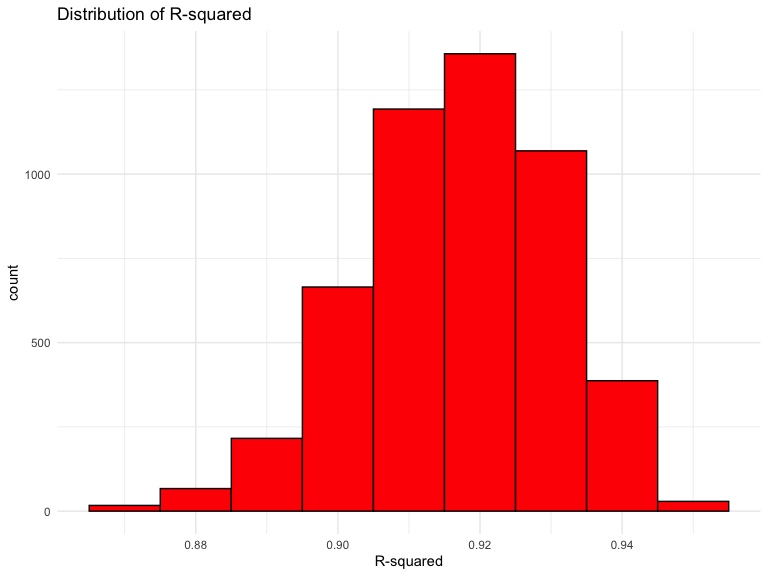
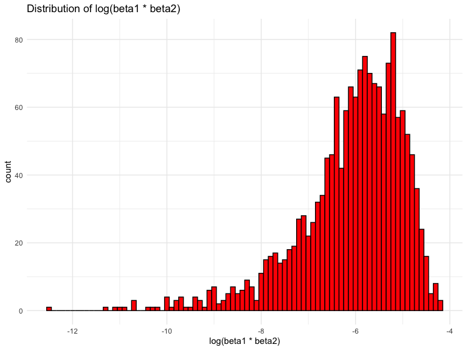

p8105_hw6_ht2607
================

### Setting Up

### Question 1

### Question 2

``` r
library(tidyverse)
library(p8105.datasets)

set.seed(1)
```

``` r
weather_df = 
  rnoaa::meteo_pull_monitors(
    c("USW00094728"),
    var = c("PRCP", "TMIN", "TMAX"), 
    date_min = "2022-01-01",
    date_max = "2022-12-31") |>
  mutate(
    name = recode(id, USW00094728 = "CentralPark_NY"),
    tmin = tmin / 10,
    tmax = tmax / 10) |>
  select(name, id, everything())
```

    ## using cached file: /Users/cindytseng/Library/Caches/org.R-project.R/R/rnoaa/noaa_ghcnd/USW00094728.dly

    ## date created (size, mb): 2023-09-28 10:20:05.85535 (8.524)

    ## file min/max dates: 1869-01-01 / 2023-09-30

``` r
# Defining the linear regression model function
lm_model <- function(data) {
  lm(tmax ~ tmin + prcp, data = data)
}
```

``` r
# Use modelr::bootstrap with n = 5000 and purrr::map functions
bootstrap_results <- modelr::bootstrap(weather_df, n = 5000)

# Fit models on each bootstrap sample
models <- purrr::map(bootstrap_results$strap, ~ lm_model(.))

# Extract coefficients using broom::tidy
results <- purrr::map(models, broom::tidy)
```

``` r
# Extract R-squared and log(beta1 * beta2) using broom::glance() and broom::tidy()
extract_values <- function(fit) {
  glance_data <- broom::glance(fit)
  rsquared <- glance_data$r.squared
  
  coef_summary <- broom::tidy(fit)
  beta_product <- log(coef_summary$estimate[2] * coef_summary$estimate[3])
  
  tibble(rsquared = rsquared, beta_product = beta_product)
}
```

``` r
# Applying the function to each fitted model using purrr::map
model_values <- purrr::map(models, ~ extract_values(.))
```

``` r
# Combining the values into a matrix using bind_rows
model_matrix <- bind_rows(model_values)
```

``` r
# Plotting the distributions
dist_r= 
ggplot(model_matrix, aes(x = rsquared)) +
  geom_histogram(binwidth = 0.01, fill = "red", color = "black") +
  labs(title = "Distribution of R-squared", x = "R-squared")

beta_plot=
ggplot(model_matrix, aes(x = beta_product)) +
  geom_histogram(binwidth = 0.1, fill = "red", color = "black") +
  labs(title = "Distribution of log(beta1 * beta2)", x = "log(beta1 * beta2)")

#view the plot
dist_r
```



``` r
beta_plot
```



``` r
# Remove rows with missing or NaN values in beta_product column
cleaned_model_matrix <- model_matrix |> 
  filter(!is.na(beta_product) & !is.nan(beta_product))

# Confidence intervals for R-squared and log(beta1 * beta2) using dplyr's summarize()
confidence_intervals= 
  cleaned_model_matrix |> 
  summarise(
    ci_lower_rsquared = quantile(rsquared, 0.025, na.rm = TRUE),
    ci_upper_rsquared = quantile(rsquared, 0.975, na.rm = TRUE),
    ci_lower_beta = quantile(beta_product, 0.025, na.rm = TRUE),
    ci_upper_beta = quantile(beta_product, 0.975, na.rm = TRUE)
  )

confidence_intervals
```

    ## # A tibble: 1 × 4
    ##   ci_lower_rsquared ci_upper_rsquared ci_lower_beta ci_upper_beta
    ##               <dbl>             <dbl>         <dbl>         <dbl>
    ## 1             0.880             0.927         -8.98         -4.60

## Question 3

``` r
birthweight_df = 
  read_csv(file = "/Users/cindytseng/Desktop/p8105_hw6_ht2607/data/birthweight.csv",
           na = ".") |>
  janitor::clean_names() |> 
  drop_na()
```

    ## Rows: 4342 Columns: 20
    ## ── Column specification ────────────────────────────────────────────────────────
    ## Delimiter: ","
    ## dbl (20): babysex, bhead, blength, bwt, delwt, fincome, frace, gaweeks, malf...
    ## 
    ## ℹ Use `spec()` to retrieve the full column specification for this data.
    ## ℹ Specify the column types or set `show_col_types = FALSE` to quiet this message.

``` r
# Convert 'babysex' to factor
birthweight_df$babysex <- factor(birthweight_df$babysex, levels = c(1, 2), labels = c("male", "female"))
```

``` r
# Model building
birthweight_model= 
  lm(bwt ~ bhead + blength + gaweeks + fincome + frace, data = birthweight_df)

# Checking the fit model
summary(birthweight_model)
```

    ## 
    ## Call:
    ## lm(formula = bwt ~ bhead + blength + gaweeks + fincome + frace, 
    ##     data = birthweight_df)
    ## 
    ## Residuals:
    ##      Min       1Q   Median       3Q      Max 
    ## -1100.80  -185.72    -7.98   179.25  2561.62 
    ## 
    ## Coefficients:
    ##               Estimate Std. Error t value Pr(>|t|)    
    ## (Intercept) -6011.1794    97.3029 -61.778  < 2e-16 ***
    ## bhead         137.1881     3.4957  39.245  < 2e-16 ***
    ## blength        80.7755     2.0617  39.179  < 2e-16 ***
    ## gaweeks        13.2073     1.4960   8.828  < 2e-16 ***
    ## fincome         0.8400     0.1732   4.849 1.28e-06 ***
    ## frace         -40.6600     5.2860  -7.692 1.78e-14 ***
    ## ---
    ## Signif. codes:  0 '***' 0.001 '**' 0.01 '*' 0.05 '.' 0.1 ' ' 1
    ## 
    ## Residual standard error: 282.6 on 4336 degrees of freedom
    ## Multiple R-squared:  0.6959, Adjusted R-squared:  0.6955 
    ## F-statistic:  1984 on 5 and 4336 DF,  p-value: < 2.2e-16

``` r
# Assuming 'initial_model' is your linear regression model and 'data' is your dataset
formula <- as.formula("bwt ~ bhead + blength + gaweeks + fincome + frace")

# Define the number of folds for cross-validation
k <- 10  # Number of folds

# Perform k-fold cross-validation
set.seed(1)  # Set seed for reproducibility
fold_indices <- sample(1:k, nrow(birthweight_df), replace = TRUE)

# Initialize vectors to store predictions and actual values
all_predictions <- numeric()
all_actual <- numeric()

for (i in 1:k) {
  fold_data <- birthweight_df[fold_indices == i, ]  # Subset birthweight_df for the current fold
  fold_train <- birthweight_df[fold_indices != i, ]  # Training birthweight_df for the current fold
  
  # Fit the model on training data
  fold_model <- lm(bwt ~ bhead + blength + gaweeks + fincome + frace, data = fold_train)
  
  # Predict on the validation set
  fold_predictions <- predict(fold_model, newdata = fold_data)
  
  # Store predictions and actual values
  all_predictions <- c(all_predictions, fold_predictions)
  all_actual <- c(all_actual, fold_data$bwt)
}

# Compute RMSE and R-squared
RMSE <- sqrt(mean((all_predictions - all_actual)^2))
R_squared <- cor(all_predictions, all_actual)^2

# View computed metrics
RMSE
```

    ## [1] 283.1753

``` r
R_squared
```

    ## [1] 0.6942216

``` r
# Get fitted values and residuals
birthweight_model_df <- data.frame(
  .fitted = fitted(birthweight_model),  # Fitted values from the model
  .resid = residuals(birthweight_model) # Residuals from the model
)

# Plotting for residuals against fitted values
ggplot(birthweight_model_df, aes(x = .fitted, y = .resid)) +
  geom_point() +
  geom_hline(yintercept = 0, linetype = "dashed") +
  labs(x = "Fitted Values", y = "Residuals", title = "Residuals vs Fitted Values Plot")
```


Propose a regression model for birthweight. This model may be based on a
hypothesized structure for the factors that underly birthweight, on a
data-driven model-building process, or a combination of the two.
Describe your modeling process and show a plot of model residuals
against fitted values – use add_predictions and add_residuals in making
this plot.

``` r
# Define the number of folds for cross-validation
k <- 10  # Number of folds

# Function to perform cross-validation and return MSE
perform_cv <- function(model, birthweight_df, k) {
  set.seed(1)  # Set seed for reproducibility
  n <- nrow(birthweight_df)
  fold_indices <- sample(1:k, n, replace = TRUE)

  mse_values <- numeric(k)

  for (i in 1:k) {
    fold_data <- birthweight_df[fold_indices == i, ]
    fold_train <- birthweight_df[fold_indices != i, ]

    # Fit the model on training data
    fold_model <- lm(model, data = fold_train)

    # Predict on the validation set
    fold_predictions <- predict(fold_model, newdata = fold_data)

    # Compute MSE for the fold
    mse_values[i] <- mean((fold_predictions - fold_data$bwt)^2)
  }

  return(mean(mse_values))
}

# Model 1 - Using Length at Birth and Gestational Age as Predictors (Main Effects)
# Perform cross-validation for Model 1
mse_model_1 <- perform_cv("bwt ~ blength + gaweeks", birthweight_df, k)

# Model 2 - Using Head Circumference, Length, Sex, and Interactions
# Perform cross-validation for Model 2
mse_model_2 <- perform_cv("bwt ~ bhead + blength + babysex + bhead:blength + bhead:babysex + blength:babysex + bhead:blength:babysex", birthweight_df, k)

# Compare the models by comparing their MSE
mse_model_1  # View MSE for Model 1
```

    ## [1] 111344.7

``` r
mse_model_2  # View MSE for Model 2
```

    ## [1] 83777.73
