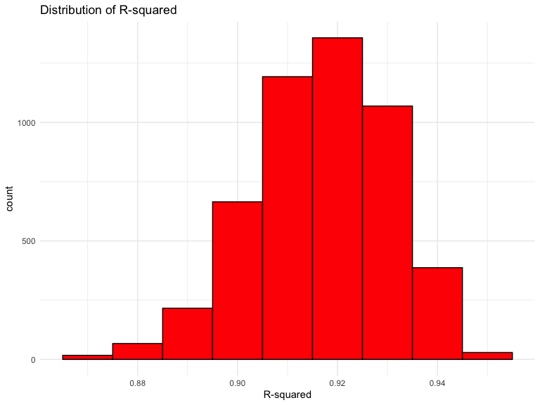
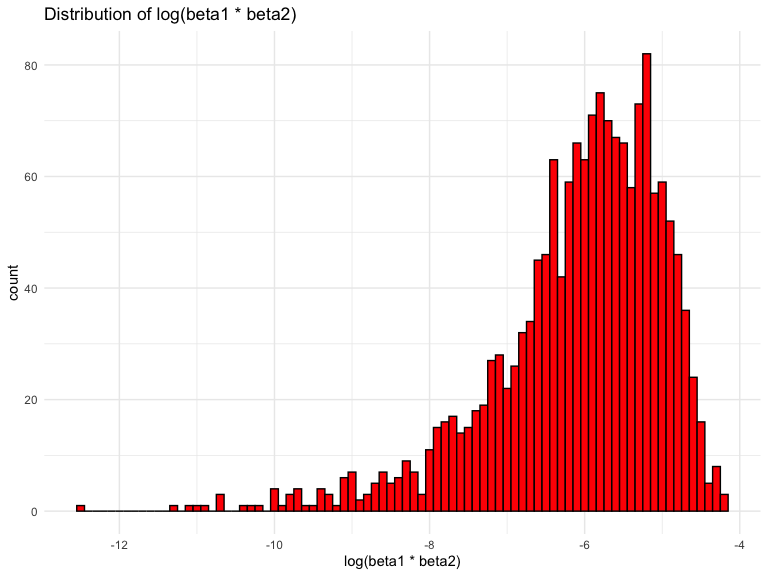
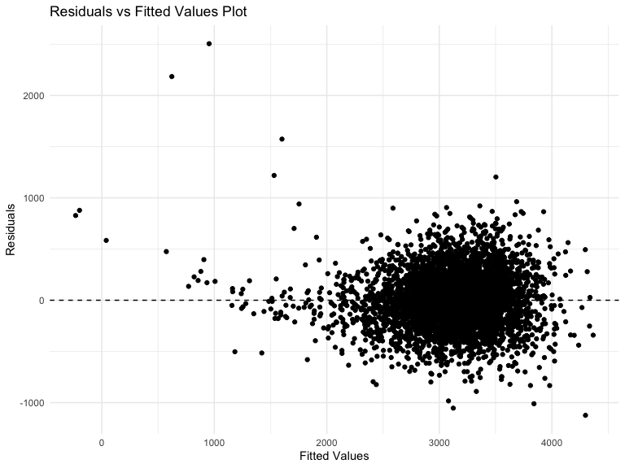
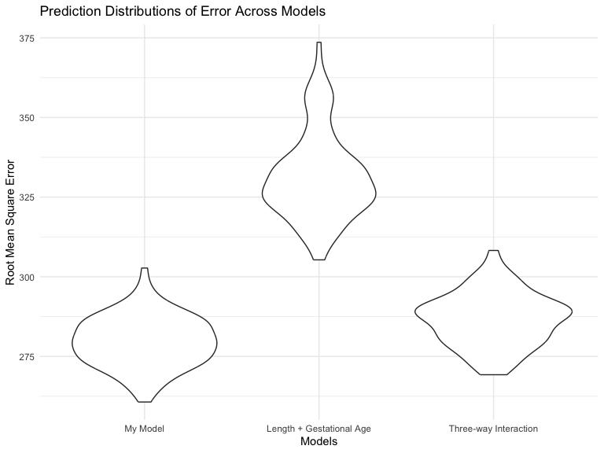

p8105_hw6_ht2607
================

### Setting Up

### Question 1

In the data cleaning code below we create a `city_state` variable,
change `victim_age` to numeric, modifiy victim_race to have categories
white and non-white, with white as the reference category, and create a
`resolution` variable indicating whether the homicide is solved. Lastly,
we filtered out the following cities: Tulsa, AL; Dallas, TX; Phoenix,
AZ; and Kansas City, MO; and we retained only the variables
`city_state`, `resolution`, `victim_age`, `victim_sex`, and
`victim_race`.

``` r
homicide_df = 
  read_csv("data/homicide-data.csv", na = c("", "NA", "Unknown")) |> 
  mutate(
    city_state = str_c(city, state, sep = ", "),
    victim_age = as.numeric(victim_age),
    resolution = case_when(
      disposition == "Closed without arrest" ~ 0,
      disposition == "Open/No arrest"        ~ 0,
      disposition == "Closed by arrest"      ~ 1)
  ) |> 
  filter(victim_race %in% c("White", "Black")) |> 
  filter(!(city_state %in% c("Tulsa, AL", "Dallas, TX", "Phoenix, AZ", "Kansas City, MO"))) |> 
  select(city_state, resolution, victim_age, victim_sex, victim_race)
```

    ## Rows: 52179 Columns: 12
    ## ── Column specification ────────────────────────────────────────────────────────
    ## Delimiter: ","
    ## chr (8): uid, victim_last, victim_first, victim_race, victim_sex, city, stat...
    ## dbl (4): reported_date, victim_age, lat, lon
    ## 
    ## ℹ Use `spec()` to retrieve the full column specification for this data.
    ## ℹ Specify the column types or set `show_col_types = FALSE` to quiet this message.

Next we fit a logistic regression model using only data from Baltimore,
MD. We model `resolved` as the outcome and `victim_age`, `victim_sex`,
and `victim_race` as predictors. We save the output as `baltimore_glm`
so that we can apply `broom::tidy` to this object and obtain the
estimate and confidence interval of the adjusted odds ratio for solving
homicides comparing non-white victims to white victims.

``` r
baltimore_glm = 
  filter(homicide_df, city_state == "Baltimore, MD") |> 
  glm(resolution ~ victim_age + victim_sex + victim_race, family = binomial(), data = _)

baltimore_glm |> 
  broom::tidy() |> 
  mutate(
    OR = exp(estimate), 
    OR_CI_upper = exp(estimate + 1.96 * std.error),
    OR_CI_lower = exp(estimate - 1.96 * std.error)) |> 
  filter(term == "victim_sexMale") |> 
  select(OR, OR_CI_lower, OR_CI_upper) |>
  knitr::kable(digits = 3)
```

|    OR | OR_CI_lower | OR_CI_upper |
|------:|------------:|------------:|
| 0.426 |       0.325 |       0.558 |

Below, by incorporating `nest()`, `map()`, and `unnest()` into the
preceding Baltimore-specific code, we fit a model for each of the
cities, and extract the adjusted odds ratio (and CI) for solving
homicides comparing non-white victims to white victims. We show the
first 5 rows of the resulting dataframe of model results.

``` r
model_results = 
  homicide_df |> 
  nest(data = -city_state) |> 
  mutate(
    models = map(data, \(df) glm(resolution ~ victim_age + victim_sex + victim_race, 
                             family = binomial(), data = df)),
    tidy_models = map(models, broom::tidy)) |> 
  select(-models, -data) |> 
  unnest(cols = tidy_models) |> 
  mutate(
    OR = exp(estimate), 
    OR_CI_upper = exp(estimate + 1.96 * std.error),
    OR_CI_lower = exp(estimate - 1.96 * std.error)) |> 
  filter(term == "victim_sexMale") |> 
  select(city_state, OR, OR_CI_lower, OR_CI_upper)

model_results |>
  slice(1:5) |> 
  knitr::kable(digits = 3)
```

| city_state      |    OR | OR_CI_lower | OR_CI_upper |
|:----------------|------:|------------:|------------:|
| Albuquerque, NM | 1.767 |       0.831 |       3.761 |
| Atlanta, GA     | 1.000 |       0.684 |       1.463 |
| Baltimore, MD   | 0.426 |       0.325 |       0.558 |
| Baton Rouge, LA | 0.381 |       0.209 |       0.695 |
| Birmingham, AL  | 0.870 |       0.574 |       1.318 |

Below we generate a plot of the estimated ORs and CIs for each city,
ordered by magnitude of the OR from smallest to largest. From this plot
we see that most cities have odds ratios that are smaller than 1,
suggesting that crimes with male victims have smaller odds of resolution
compared to crimes with female victims after adjusting for victim age
and race. This disparity is strongest in New yrok. In roughly half of
these cities, confidence intervals are narrow and do not contain 1,
suggesting a significant difference in resolution rates by sex after
adjustment for victim age and race.

``` r
model_results |> 
  mutate(city_state = fct_reorder(city_state, OR)) |> 
  ggplot(aes(x = city_state, y = OR)) + 
  geom_point() + 
  geom_errorbar(aes(ymin = OR_CI_lower, ymax = OR_CI_upper)) + 
  theme(axis.text.x = element_text(angle = 90, hjust = 1))
```


### Question 2

Step 1: loaded the needed package and set the seed for the work

``` r
library(tidyverse)
library(p8105.datasets)

set.seed(1)
```

Step 2: downloaded the dataset and named ‘weather_df’

``` r
weather_df = 
  rnoaa::meteo_pull_monitors(
    c("USW00094728"),
    var = c("PRCP", "TMIN", "TMAX"), 
    date_min = "2022-01-01",
    date_max = "2022-12-31") |>
  mutate(
    name = recode(id, USW00094728 = "CentralPark_NY"),
    tmin = tmin / 10,
    tmax = tmax / 10) |>
  select(name, id, everything())
```

    ## using cached file: /Users/cindytseng/Library/Caches/org.R-project.R/R/rnoaa/noaa_ghcnd/USW00094728.dly

    ## date created (size, mb): 2023-09-28 10:20:05.85535 (8.524)

    ## file min/max dates: 1869-01-01 / 2023-09-30

Step 3: created a linear regression model

``` r
# Defining the linear regression model function
lm_model <- function(data) {
  lm(tmax ~ tmin + prcp, data = data)
}
```

Step 4: using bootstrap with 5000 samples from the weather_df dataset ,
then fit into the linear regression model that defined in the previous
step. Then, extrea the coefficients from the bootstrap sample.

``` r
# Use modelr::bootstrap with n = 5000 and purrr::map functions
bootstrap_results <- modelr::bootstrap(weather_df, n = 5000)

# Fit models on each bootstrap sample
models <- purrr::map(bootstrap_results$strap, ~ lm_model(.))

# Extract coefficients using broom::tidy
results <- purrr::map(models, broom::tidy)
```

Step 5: extract r-squares and log(beta1 \* beta2) from the bootstrap
result

``` r
# Extract R-squared and log(beta1 * beta2) using broom::glance() and broom::tidy()
extract_values <- function(fit) {
  glance_data <- broom::glance(fit)
  rsquared <- glance_data$r.squared
  
  coef_summary <- broom::tidy(fit)
  beta_product <- log(coef_summary$estimate[2] * coef_summary$estimate[3])
  
  tibble(rsquared = rsquared, beta_product = beta_product)
}
```

Step 6: applying the model to each extract values

``` r
# Applying the function to each fitted model using purrr::map
model_values <- purrr::map(models, ~ extract_values(.))
```

Step 7: combine the all the model values

``` r
# Combining the values into a matrix using bind_rows
model_matrix <- bind_rows(model_values)
```

Step 8: plotting the distributions

``` r
# Plotting the distributions
dist_r= 
ggplot(model_matrix, aes(x = rsquared)) +
  geom_histogram(binwidth = 0.01, fill = "red", color = "black") +
  labs(title = "Distribution of R-squared", x = "R-squared")

beta_plot=
ggplot(model_matrix, aes(x = beta_product)) +
  geom_histogram(binwidth = 0.1, fill = "red", color = "black") +
  labs(title = "Distribution of log(beta1 * beta2)", x = "log(beta1 * beta2)")

#view the plot
dist_r
```



``` r
beta_plot
```



The distribution of the r squared plot seen to be normal distribute,
where the peak point is around 0.92. However, the beta_plot seen to be
left skewed, which the mean is greater the median in this dataset.
However, this might due to the reason that since beta2 is negative,
which we cannot take the log to the negative value. As a result, when we
are plotting there are 3361 data points were removed from the 5000
booststraping result.

Step 9: removed the NAs from the model values and summarise the
confidence intervals from the clean model dataframe

``` r
# Remove rows with missing or NaN values in beta_product column
cleaned_model_matrix <- model_matrix |> 
  filter(!is.na(beta_product) & !is.nan(beta_product))

# Confidence intervals for R-squared and log(beta1 * beta2) using dplyr's summarize()
confidence_intervals= 
  cleaned_model_matrix |> 
  summarise(
    ci_lower_rsquared = quantile(rsquared, 0.025, na.rm = TRUE),
    ci_upper_rsquared = quantile(rsquared, 0.975, na.rm = TRUE),
    ci_lower_beta = quantile(beta_product, 0.025, na.rm = TRUE),
    ci_upper_beta = quantile(beta_product, 0.975, na.rm = TRUE)
  )

confidence_intervals
```

    ## # A tibble: 1 × 4
    ##   ci_lower_rsquared ci_upper_rsquared ci_lower_beta ci_upper_beta
    ##               <dbl>             <dbl>         <dbl>         <dbl>
    ## 1             0.880             0.927         -8.98         -4.60

The confidence interval is ci_lower_rsquared ci_upper_rsquared
ci_lower_beta ci_upper_beta

1 0.880 0.927 -8.98 -4.60

## Question 3

Step 1: imported the data into r, clean the dataset to removed any NAs,
and convert numeric to factor for the variables ‘babysex’, ‘malform’,
‘frace’, and ‘mrace’.

``` r
birthweight_df = 
  read_csv(file = "/Users/cindytseng/Desktop/p8105_hw6_ht2607/data/birthweight.csv",
           na = ".") |>
  janitor::clean_names() |> 
  drop_na()
```

    ## Rows: 4342 Columns: 20
    ## ── Column specification ────────────────────────────────────────────────────────
    ## Delimiter: ","
    ## dbl (20): babysex, bhead, blength, bwt, delwt, fincome, frace, gaweeks, malf...
    ## 
    ## ℹ Use `spec()` to retrieve the full column specification for this data.
    ## ℹ Specify the column types or set `show_col_types = FALSE` to quiet this message.

``` r
# Convert 'babysex' to factor
birthweight_df$babysex <- factor(birthweight_df$babysex, levels = c(1, 2), labels = c("male", "female"))

# Convert 'malform' to factor
birthweight_df$malform <- factor(birthweight_df$malform, levels = c(0, 1), labels = c("absent", "present"))

# Convert 'frace' to factor
birthweight_df$frace <- factor(birthweight_df$frace, levels = c(1, 2, 3, 4, 8, 9), labels = c("White", "Black", "Asian","Puerto Rican", "Other", "Unknown" ))

# Convert 'mrace' to factor
birthweight_df$mrace <- factor(birthweight_df$mrace, levels = c(1, 2, 3, 4, 8), labels = c("White", "Black", "Asian","Puerto Rican", "Other"))
```

Step 2: Builded my own regression model and performed cross-validation.
Then, created a dataframe to store the results and fit the values to the
building model to compute RMSE and R-squared.

``` r
# Model building
birthweight_model= 
  lm(bwt ~ bhead + blength + gaweeks + fincome + frace, data = birthweight_df)

# Checking the fit model
summary(birthweight_model)
```

    ## 
    ## Call:
    ## lm(formula = bwt ~ bhead + blength + gaweeks + fincome + frace, 
    ##     data = birthweight_df)
    ## 
    ## Residuals:
    ##      Min       1Q   Median       3Q      Max 
    ## -1123.58  -187.30    -7.16   178.64  2504.99 
    ## 
    ## Coefficients:
    ##                     Estimate Std. Error t value Pr(>|t|)    
    ## (Intercept)       -5857.9235    98.5518 -59.440  < 2e-16 ***
    ## bhead               134.9410     3.4817  38.757  < 2e-16 ***
    ## blength              79.9990     2.0485  39.052  < 2e-16 ***
    ## gaweeks              12.3611     1.4885   8.305  < 2e-16 ***
    ## fincome               0.4257     0.1792   2.376   0.0176 *  
    ## fraceBlack         -108.2266     9.8514 -10.986  < 2e-16 ***
    ## fraceAsian          -61.4573    41.8462  -1.469   0.1420    
    ## fracePuerto Rican  -109.3691    19.1605  -5.708 1.22e-08 ***
    ## fraceOther          -44.4833    75.3196  -0.591   0.5548    
    ## ---
    ## Signif. codes:  0 '***' 0.001 '**' 0.01 '*' 0.05 '.' 0.1 ' ' 1
    ## 
    ## Residual standard error: 280.5 on 4333 degrees of freedom
    ## Multiple R-squared:  0.7006, Adjusted R-squared:  0.7001 
    ## F-statistic:  1268 on 8 and 4333 DF,  p-value: < 2.2e-16

``` r
# Assuming 'initial_model' is your linear regression model and 'data' is your dataset
formula <- as.formula("bwt ~ bhead + blength + gaweeks + fincome + frace")

# Define the number of folds for cross-validation
k <- 10  # Number of folds

# Perform k-fold cross-validation
set.seed(1)  # Set seed for reproducibility
fold_indices <- sample(1:k, nrow(birthweight_df), replace = TRUE)

# Initialize vectors to store predictions and actual values
all_predictions <- numeric()
all_actual <- numeric()

for (i in 1:k) {
  fold_data <- birthweight_df[fold_indices == i, ]  # Subset birthweight_df for the current fold
  fold_train <- birthweight_df[fold_indices != i, ]  # Training birthweight_df for the current fold
  
  # Fit the model on training data
  fold_model <- lm(bwt ~ bhead + blength + gaweeks + fincome + frace, data = fold_train)
  
  # Predict on the validation set
  fold_predictions <- predict(fold_model, newdata = fold_data)
  
  # Store predictions and actual values
  all_predictions <- c(all_predictions, fold_predictions)
  all_actual <- c(all_actual, fold_data$bwt)
}

# Compute RMSE and R-squared
RMSE <- sqrt(mean((all_predictions - all_actual)^2))
R_squared <- cor(all_predictions, all_actual)^2

# View computed metrics
RMSE
```

    ## [1] 281.1184

``` r
R_squared
```

    ## [1] 0.6986482

RMSE: 281.1184 R_squared: 0.6986482

Propose a regression model for birthweight. This model may be based on a
hypothesized structure for the factors that underly birthweight, on a
data-driven model-building process, or a combination of the two.
Describe your modeling process and show a plot of model residuals
against fitted values – use add_predictions and add_residuals in making
this plot.

Step 3: getting the fitted value and residuals by fitting into the
building model. Then, plotting for residuals against fitted values using
the add_predictions and add_residuals.

``` r
# Get fitted values and residuals
birthweight_model_df <- data.frame(
  .fitted = fitted(birthweight_model),  # Fitted values from the model
  .resid = residuals(birthweight_model) # Residuals from the model
)

# Plotting for residuals against fitted values
ggplot(birthweight_model_df, aes(x = .fitted, y = .resid)) +
  geom_point() +
  geom_hline(yintercept = 0, linetype = "dashed") +
  labs(x = "Fitted Values", y = "Residuals", title = "Residuals vs Fitted Values Plot")
```



From the plot, it is clear to see that majority of the random dispersion
of residuals are around the zero line, indicating good adherence to
homoscedasticity and linearity assumptions. Yet, a few outliers,
especially for higher fitted values, imply the model’s struggle in
predicting unusually large or small birthweights. However, there’s no
distinct pattern indicating non-linearity or heteroscedasticity from
this plot.

Step 4: setting the seed and perform cross validation using crossv_mc
function into multiple folds with 100 repetitions and 0.2 train-test.
Then, the dataset is splits into two tibbles (train and test). In
addition, using the training data to fit into three different models
(my_model, model_1, and model_2). Afterward, using map2_dbl function to
calculate the RMSE for each model applied to the respective test set
create a new columen to store the computed RMSE values for the
respective models ((rmse_my_model, rmse_model_1, rmse_model_2).

Model descriptions:

my_model: Multiple linear regression (lm) using a set of predictor
variables (bhead, blength, gaweeks, fincome, frace). model_1: Another
linear regression using a subset of predictors (blength and gaweeks).
model_2: A more complex regression model involving interactions and
higher-order terms among predictors (bhead, blength, babysex).

``` r
#### Computing rmse of models through cross validation
set.seed(1)

birthweight_dataset <-
  birthweight_df |>  
  crossv_mc(n = 100,test = 0.2)
  

birth_df <- 
  birthweight_dataset |> 
   mutate(
    train = map(train, as_tibble),
    test = map(test, as_tibble))

birth_df <-
  birth_df |> 
    mutate(
    my_model  = map(train, ~lm(bwt ~ bhead + blength + gaweeks + fincome + frace, data = birthweight_df)),
    model_1 = map(train, ~lm(bwt ~ blength + gaweeks, data = birthweight_df)),
    model_2  = map(train, ~lm(bwt ~ bhead + blength + babysex + bhead:blength + bhead:babysex + blength:babysex + bhead:blength:babysex, data = birthweight_df)
)) |> 
   mutate(
    rmse_my_model = map2_dbl(my_model, test, ~rmse(model = .x, data = .y)),
    rmse_model_1 = map2_dbl(model_1, test, ~rmse(model = .x, data = .y)),
    rmse_model_2 = map2_dbl(model_2, test, ~rmse(model = .x, data = .y))
   )
```

Step 5: combined the the RMSE values and created plot showing the
prediction of the error distributions across all three models.

``` r
birth_df |> 
  select(starts_with("rmse")) |> 
  pivot_longer(
    cols = starts_with("rmse"),
    names_to = "model", 
    values_to = "rmse",
    names_prefix = "rmse_") |>  
  mutate(model = fct_inorder(model)) |>  
  ggplot(aes(x = model, y = rmse)) + 
  geom_violin() +
  labs(title = 
  "Prediction Distributions of Error Across Models", 
       x = "Models", y = "Root Mean Square Error")  +
  scale_x_discrete(
    labels = c("My Model", "Length + Gestational Age", "Three-way Interaction")) +
  theme_minimal()
```



From the plot, it is clear to see that my model has the lowest RMSE
among the three model, followed by the three way interaction. This means
my model fits the data well and has more precise predictions. On the
other hand, the length + gestational age model have the highest RMSE
which this model did not fit the data well, suggest more error and less
precise predictions.
